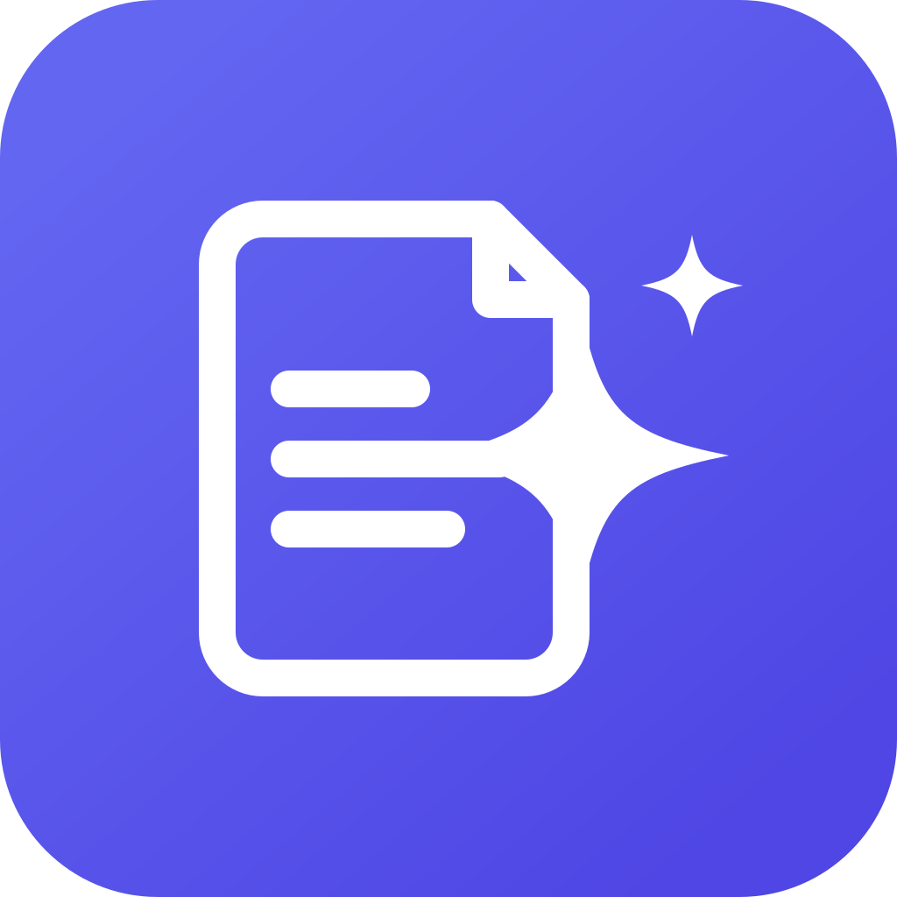

<p align="center">
  
</p>
<h1 align="center">llm-cleanup</h1>
<p align="center">
  <strong>Remove AI-generated fingerprints from your documents. Offline, deterministic, and formatting-safe.</strong>
</p>
<p align="center">
  Built by <a href="https://www.olib.ai">Olib AI</a>
</p>

---

llm-cleanup strips the tell-tale residue that large language models leave behind (em dashes, curly quotes, the narrow no-break space, invisible "smuggling" characters, overused wording) from Markdown, plain text, and Word documents. It does this without breaking a single byte of your formatting: headings, bold, italic, lists, tables, links, code blocks, images, and shapes are preserved exactly. There is no network call and no LLM at runtime.

## Why llm-cleanup

- **Formatting-safe by construction.** It never re-serializes your document. It locates the prose, cleans only that text, and splices the result back into the original bytes. If nothing matches, the output is byte-for-byte identical to the input.
- **Offline and deterministic.** No network, no model, no telemetry. The same input always produces the same output.
- **Real document support.** Markdown, plain text, and Word (.docx). DOCX keeps your images, shapes, tables, and styles intact while cleaning the text inside the runs.
- **Three cleanup levels.** Light (invisible-character hygiene only), Standard (plus visible punctuation and safe phrasing), and Aggressive (plus opt-in rewrites and stylistic flags).
- **Cross-format conversion.** Clean a .docx and save it as Markdown or text, or turn Markdown into a Word document, in one step.
- **CLI and desktop app.** A fast command-line tool (`aiclean`) and a native desktop app (`aiclean-gui`) that share the same engine.

## What it cleans

- Typographic tells: em dashes, en dashes, curly quotes and apostrophes, and the ellipsis character.
- Invisible and "smuggling" characters: zero-width spaces, the narrow no-break space that some models emit, Unicode tag characters, stray variation selectors, exotic Unicode spaces, and bidirectional override controls (the "Trojan Source" vector).
- Overused wording and provider phrasings, flagged for your review rather than blindly rewritten.

Statistical token watermarks (such as SynthID) live in word-choice probabilities, not in characters, so they are intentionally out of scope.

## Install

Download a prebuilt binary from the [Releases](https://github.com/Olib-AI/llm-cleanup/releases) page, or build from source:

```bash
git clone https://github.com/Olib-AI/llm-cleanup.git
cd llm-cleanup
cargo build --release
# binaries land in target/release/: aiclean (CLI) and aiclean-gui (desktop app)
```

## Usage

Clean a file (writes a `.cleaned` copy next to it by default):

```bash
aiclean clean report.docx --level standard
aiclean clean notes.md --level aggressive
```

Preview the changes without writing anything:

```bash
aiclean diff report.docx
```

Convert while cleaning (the output extension picks the target format):

```bash
aiclean clean report.docx -o report.md      # clean, then convert to Markdown
aiclean clean notes.md --to docx            # clean, then convert to Word
aiclean convert report.docx -o report.txt   # convert only, no cleaning
```

List the active rules for a level:

```bash
aiclean rules --level aggressive
```

### Desktop app

Launch `aiclean-gui` (or open `llm-cleanup.app` on macOS). Choose a file, pick a cleanup level and an output format, review exactly what changed, and save.

## How it works

Each format is parsed only to locate the editable prose. Rules run over that prose, producing edits that are spliced back into the original bytes. After writing, the tool re-parses the output and asserts the structure is unchanged, so a corrupt or reflowed document is never produced. For DOCX, only the text inside the `w:t` runs is touched; every other part of the package, including images and shapes, is copied through byte for byte.

## License

MIT. Copyright (c) 2026 Olib AI. See [LICENSE](LICENSE).
